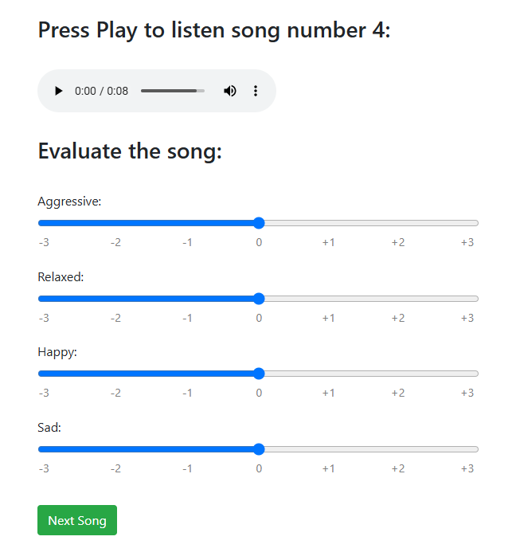

# Listening Test Web Application

This project is a web application designed to conduct listening tests, where participants evaluate songs based on emotional reactions.

## Screenshot

## Features

- **Emotion-Based Song Evaluation**: Allows users to rate songs on emotional scales from -3 (Strongly Opposed) to +3 (Strongly Present).

